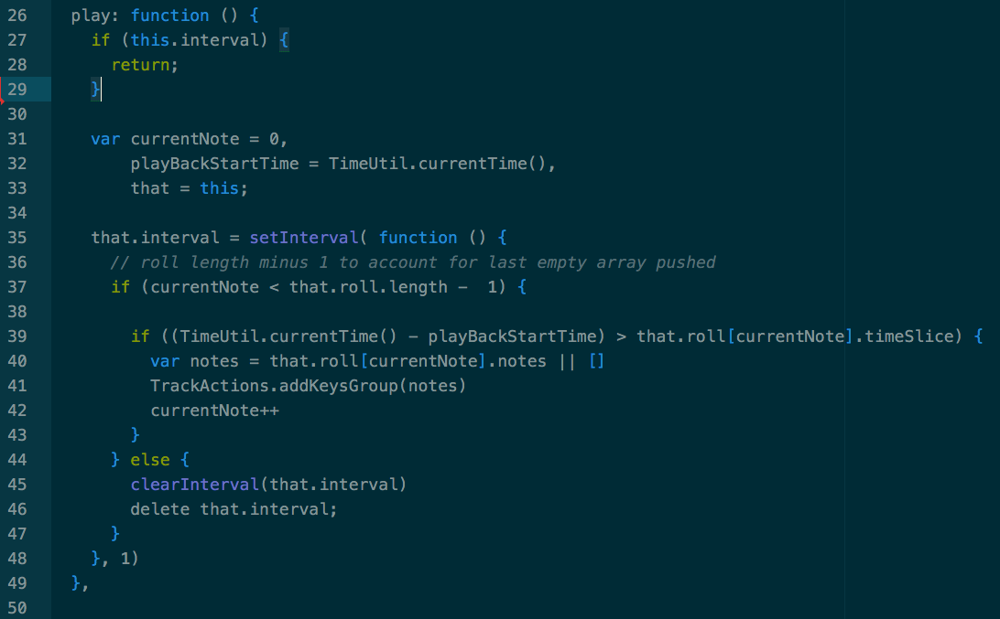
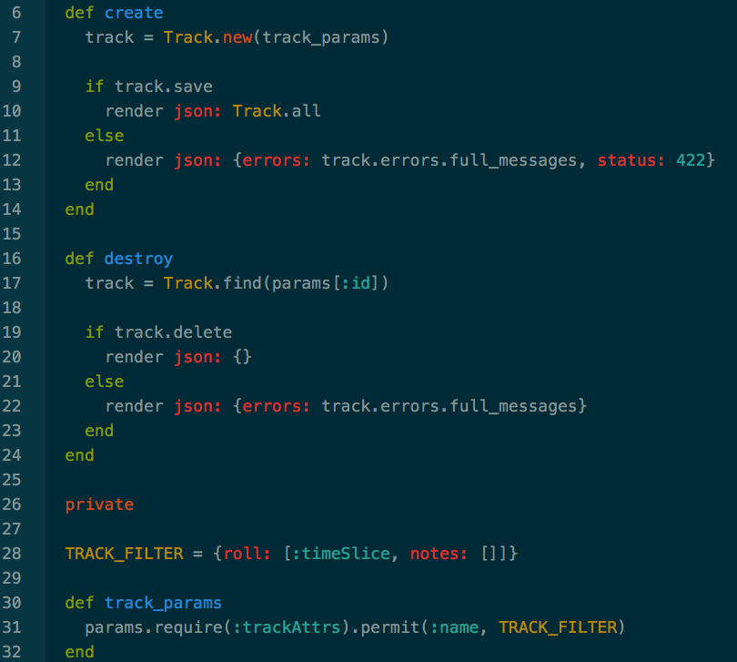

# Cool Purple Organ

[Link to Live App][heroku]

[heroku]: http://www.coolpurpleorgan.xyz

## Features
 * Makes use of React.js to play and record tracks
 * Save tracks using Rails back-end

## Code things
 * Throttles iteration using setInterval for accurate play back
 

 * Stores track's roll as JSON for future playback
 
